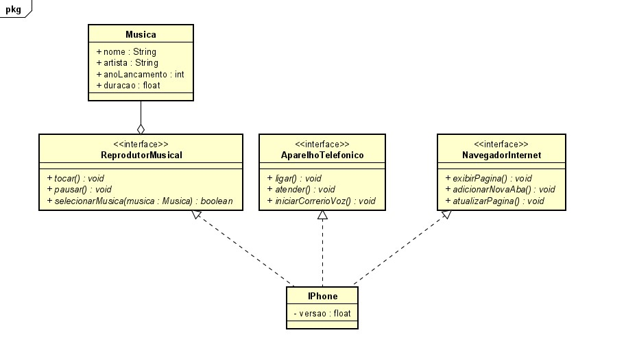

# Desafio: Classes do Iphone

O projeto atual é parte do desafio da DIO que visa colocar em prática os conceitos aprendidos nos cursos de 
Orientação à Objetos em Java. 

Além do código em Java, o projeto também consiste em um diagrama de classes UML para representar as funcionalidades 
do IPhone. O diagrama pode ser encontrado no arquivo .asta e na imagem a seguir:

